# DockM on QingCloud AppCenter User Guide

### Abstract

**DockM** is a lightweight management UI which allows you to easily manage the containers running on Docker hosts or Docker Swarm clusters. It is a platform for automating deployment, scaling the containerized applications across clusters of hosts.
The goal of DockM on QingCloud AppCenter is to help end users easily set up a Docker swarm cluster with preconfigured DockM tool in just few minutes. It also supports cluster horizontal, vertical scaling, node monitoring and alarming etc. 

### Prerequisites

To ensure high security, **DockM cluster** must run in a private network, so creating a **VPC** and managed **VxNets** is necessary before creating DockM cluster. Also join the VxNets to the VPC.  In addition, associate a public IP (**EIP**) to the VPC, which is required for accessing QingCloud IaaS API and pulling docker images from internet.

### Create an EIP

To access the DockM cluster over internet you need to create public ip (EIP) first. Please go to `Networks & CDN -> Elastic IPs` from the left navigation tree and click on **Apply** button.

 

Click on **Continue Allocate EIPs** button appearing from the pop-up menu.

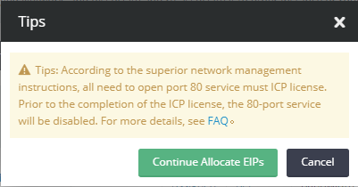

Enter the name of EIP in the **Name** field and click on **Submit** button.

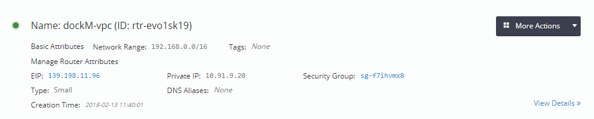 

 

### Create VxNets 

Go to `Networks & CDN->VxNets`, click on Create button.

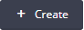 

Enter the name in **Name** filed and click on **Submit** button.  

 

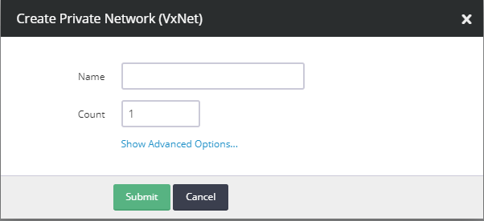 

### Create a VPC  

As shown below, through the left navigation tree on QingCloud console, go to `Networks & CDN -> VPC Networks`, click 'Create VPC Network' button

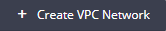 

Please **don't specify VPC Network Range to 172.17.0.0/16**, which is used by docker by default.  

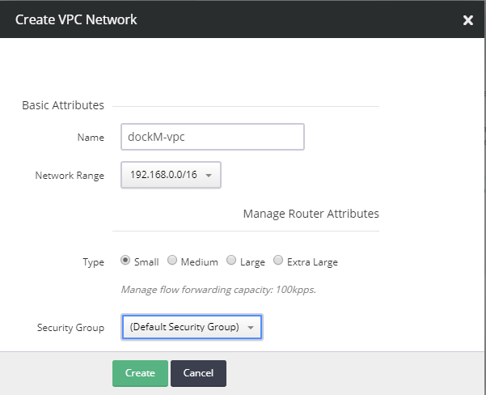

### Join VxNets to VPC

Once created the **VxNets** and the **VPC**, you need to join the **VxNets** to the **VPC** through one of the following ways.

* Please go back to the page of `VPC Networks`, click the VPC into its detailed page. In this page, associate the **EIP** you created above and VxNets to it. 

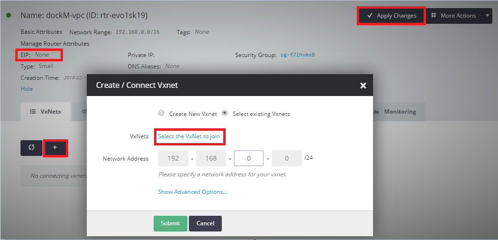

> **Note:**  After all settings are saved, please make sure to click 'Apply Changes' button on top right of the page.  

* Please go back to the page of `VxNets`, right click on it, then select `Join VPC Network` and choose the VPC you created to join.

  

### Bind public EIP to VPC

To access DockM application over the internet you need to bind public EIP to VPC.
* Go to `Networks & CDN -> Elastic Ips` from the left navigation tree and click on your created EIP.
* Select **EIP->More Actions->Associate to VPC Network**.
 
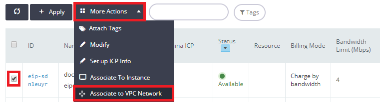 

* Now select the created vpc from drop down and click on **Submit** button.

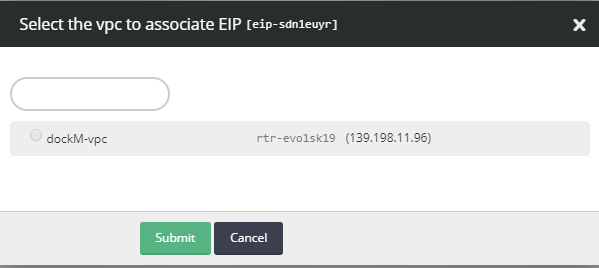 

## Create DockM cluster

After all prerequisites described above are created, you are ready to create DockM cluster.

Please go to [DockM on QingCloud AppCenter](https://appcenter.qingcloud.com/apps/dockM), click `Deploy on QingCloud` button

Select specific zone, and input the cluster info such as name, description, version, node CPU/Memory, how many nodes (nodes count) etc. 

  

  

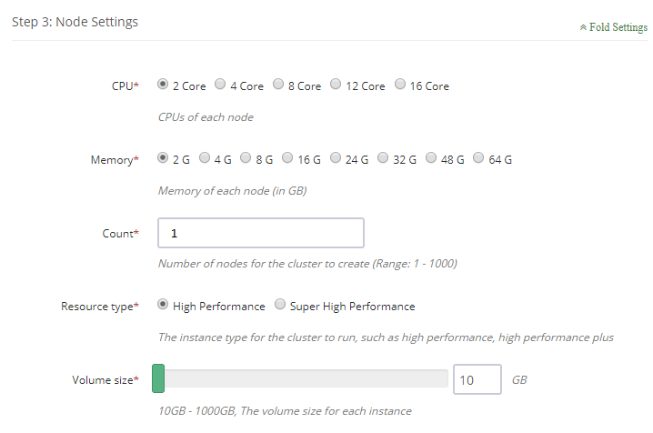

Choose the cluster VxNet for the DockM cluster.

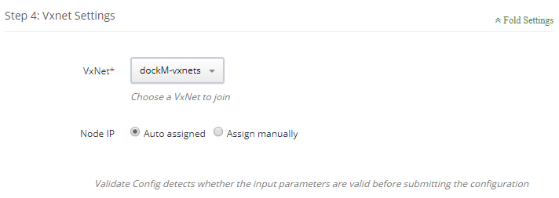

Now click on **Submit** button to create the DockM cluster.

Let the cluster's **Node Status** come in **Active state** and **Service Status** in **Healthy state**.

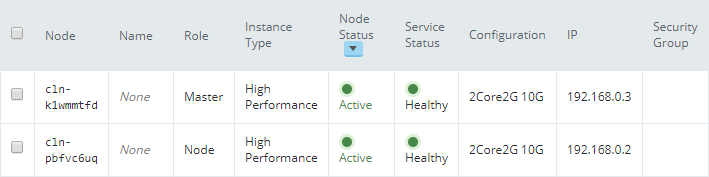

### Adding Port Forwarding rules for VPC & Security Group

To access the DockM application through browser you need to apply port-forwarding rules to to VPC and Security Group.
* Go to `Networks & CDN -> VPC Networks` and click on view details option of the VPC you created.

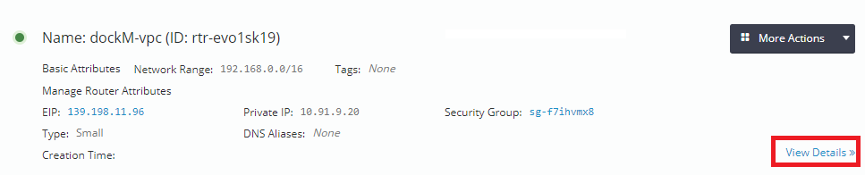

* Now click on `Management Configuration->Add Rules`. 
* Enter the master node's ip in the **Intranet Ip** textbox, **Source Port** as 9000, **Intranet Port** as 9000  and click on **Apply Changes** button.

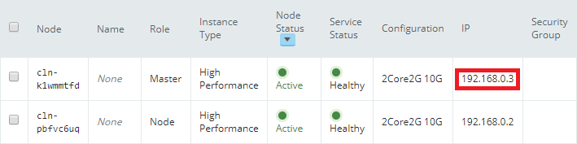

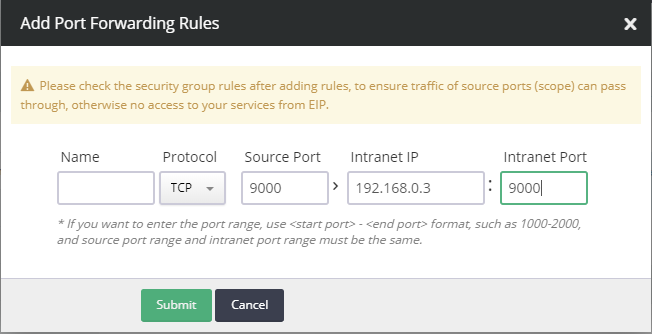

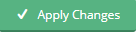

> Note: DockM application's default exposed port number is **9000**.

* Now go to `Security-> Security Groups` and click on default security group or your other security group bound to the VPC during creation of VPC.

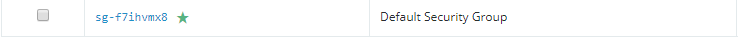

* Click on **Add Rule** button and enter the **Start Port** and **End Port** as **9000**.

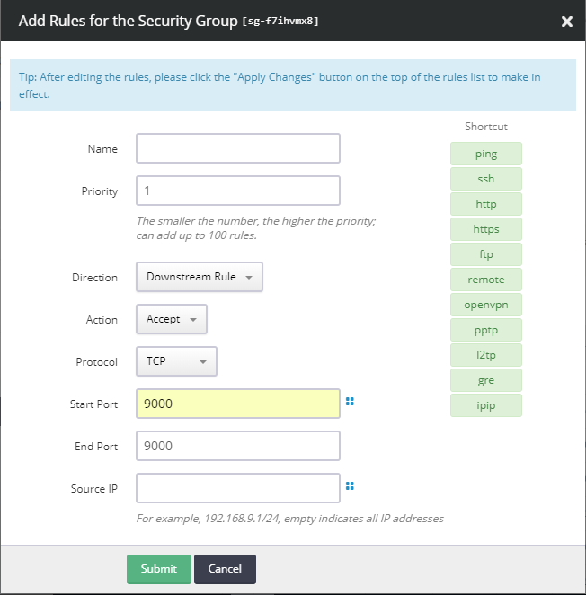

Click on **Submit** button and then **Apply Changes**

 button.

### Accessing DockM application on web browser

To access DockM application on web browser enter the EIP address which has been bound to VPC and `:` Port Number. As `EIP:9000` on the browser.

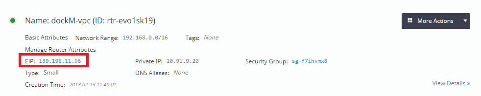

**Example : 139.198.11.96:9000**

Enter you desired password for Administrator user.

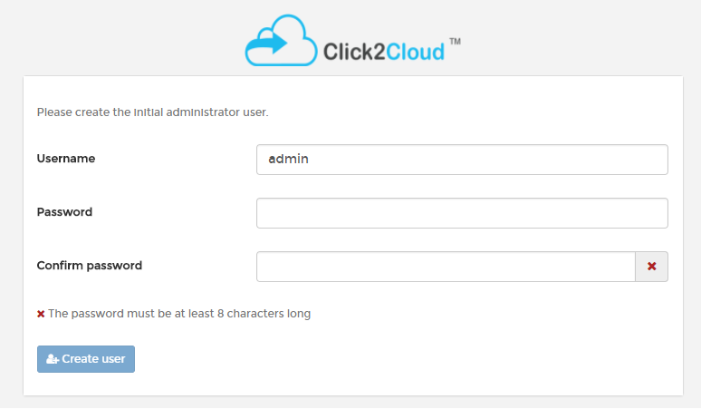

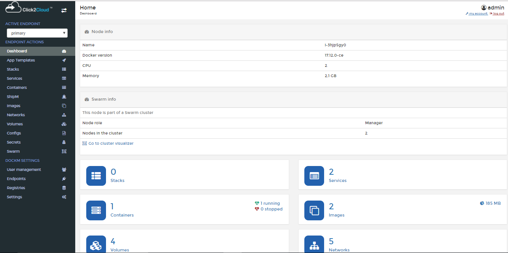

## Scale horizontal/vertical

### Add Node

Click `Add Nodes` button when workload becomes heavy such as more and more services are deployed in DockM cluster. The newly added node's status could be found in cluster detailed page.  

### Delete Node

Click `Delete` button to remove unnecessary nodes when the workload is down to low level, which saves cost for end user.  

### Scale Up/Down (Resize cluster)

User also can resize (i.e., scale up or down) cluster to change the cluster workload capacity.  

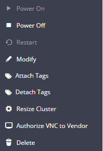

Adjust the capacity for different nodes on the pop-up page.  

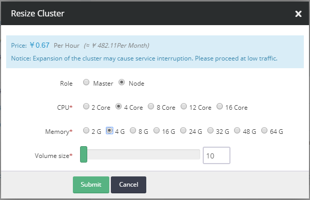

[DockM tool user guide is available here](https://click2cloud.com/en-us/product/dockM) 
